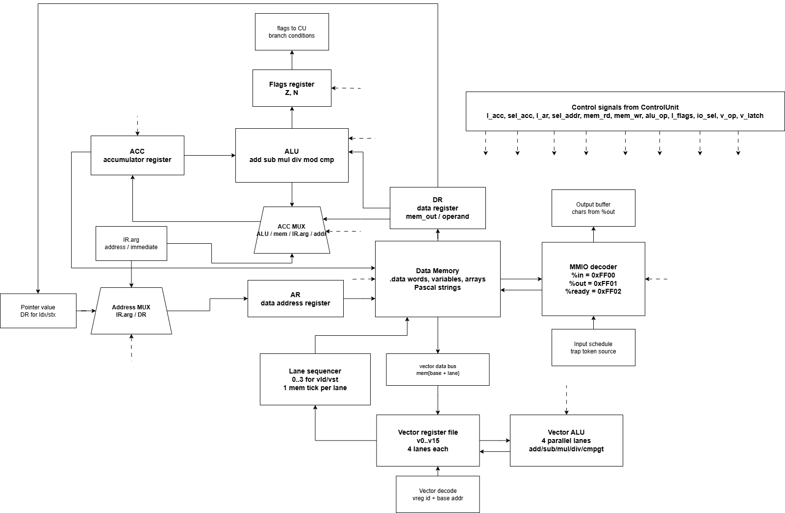
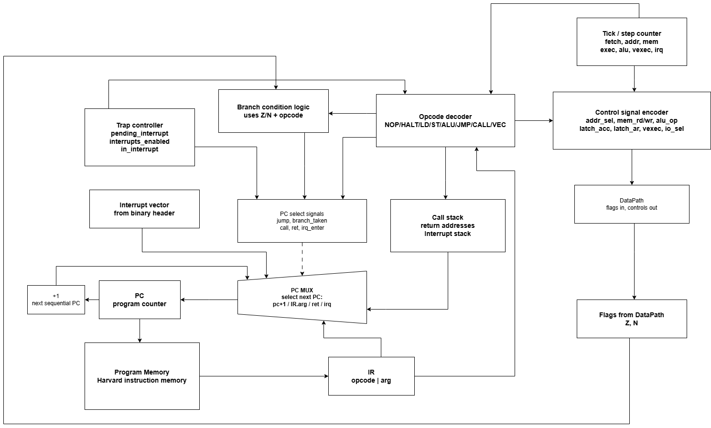

# Лабораторная работа №4

ФИО: `Мухамедьяров Артур Альбертович`  
Группа: `P3209`

Вариант:

```text
asm | acc | harv | hw | tick | binary | trap | mem | pstr | prob1 | vector
```

## Цель и состав работы

Реализована небольшая компьютерная система целиком:

- язык программирования: простой ассемблер;
- транслятор из ассемблера в бинарный машинный образ;
- система команд аккумуляторного процессора;
- tick-точная модель процессора;
- memory-mapped ввод-вывод через trap-прерывания;
- Pascal strings;
- векторные регистры и инструкции;
- программы и golden tests.

Основные файлы:

- `isa.py` - описание ISA, opcode, кодирования инструкций и бинарного формата.
- `translator.py` - транслятор `.asm` -> `.bin` + `.lst`.
- `machine.py` - модель процессора.
- `programs/` - исходные программы на разработанном ассемблере.
- `golden/` - эталонные тесты.
- `test_golden.py` - автоматическая проверка golden tests.
- `.github/workflows/ci.yml` - CI: форматирование, lint, тесты.
- `docs/schemes/` - схемы DataPath и ControlUnit.

## Запуск

Проверить все golden tests:

```bash
python test_golden.py
```

Собрать и запустить основной алгоритм:

```bash
python translator.py programs/prob1.asm prob1.bin --lst prob1.lst
cat > prob1.input.yaml <<'YAML'
- tick: 1
  value: "3"
YAML
python machine.py prob1.bin prob1.input.yaml --trace prob1.trace --max-ticks 20000000
```

Ожидаемый вывод:

```text
906609
```

## Язык программирования

Язык программы - ассемблер с двумя секциями: `.data` и `.text`.

```ebnf
program      ::= data_section text_section
data_section ::= ".data" { label directive }
text_section ::= ".text" { directive | label | instruction }
label        ::= ident ":"
directive    ::= ".word" value
               | ".words" value { value }
               | ".zero" number
               | ".pstr" string
instruction  ::= mnemonic [ operand { "," operand } ]
```

Пример:

```asm
.data
msg: .pstr "Hello, world!"

.text
.entry main
main:
    lea msg
    call print_pstr
    halt
```

Семантика последовательная: процессор выбирает инструкцию по `PC`, исполняет её и переходит к следующей инструкции или к адресу перехода. Метки имеют глобальную область видимости. Тип данных один - знаковое 32-битное машинное слово. Символ хранится как числовой код в одном слове.

### Директивы данных

| Директива | Назначение |
| --- | --- |
| `.word value` | одно машинное слово |
| `.words a b c` | несколько слов подряд |
| `.zero n` | `n` нулевых слов под буфер |
| `.pstr "text"` | Pascal string: длина, затем символы |

Для `.pstr "Hi"` в памяти данных будет:

```text
addr+0: 2
addr+1: 'H'
addr+2: 'i'
```

Работа со строками реализована процедурами на разработанном ассемблере. Например, печать Pascal string сначала читает длину, затем проходит по символам через косвенную адресацию.

## Организация памяти

Архитектура памяти - Harvard: память команд и память данных разделены.
Инструкции, статические данные, строки и рабочие буферы не смешиваются.

- память команд: массив 32-битных instruction words;
- память данных: массив 32-битных знаковых слов;
- память микрокода отсутствует: управление hardwired, opcode напрямую выбирает действия в `Machine.execute()`.

`PC` адресует ячейки памяти команд. Одна инструкция занимает одну 32-битную
ячейку:

```text
Command memory, 32-bit cells
+--------------------------------+
| 31..24 opcode                  |
| 23..0  argument payload        |
+--------------------------------+
```

Аргумент инструкции используется как immediate, адрес памяти, адрес перехода
или упакованные поля. Для обычных инструкций payload имеет 24 бита, для
векторных обращений к памяти используется формат `vreg:4 | base_addr:20`.

Память данных хранит все значения программы как 32-битные знаковые слова:

```text
Data memory, 32-bit signed cells
+--------------------------------+
| .word / .words value           |
| .zero reserved cell            |
| .pstr length                   |
| .pstr char code                |
| .pstr char code                |
| ...                            |
+--------------------------------+
```

Pascal string размещается в памяти данных как длина, затем коды символов. Для
`.pstr "Hi"`:

```text
addr+0: 2
addr+1: 'H'
addr+2: 'i'
```

Бинарный файл содержит загрузочный образ обеих памятей:

```text
Binary image
+--------------------------------+
| magic "CSA4"                   |
| entry address                  |
| interrupt vector               |
| code length                    |
| data length                    |
| code word 0                    |
| code word 1                    |
| ...                            |
| data word 0                    |
| data word 1                    |
| ...                            |
+--------------------------------+
```

После загрузки модель кладёт инструкции в `code memory`, а данные в
`data memory`. Команды записи работают только с памятью данных и MMIO, поэтому
изменить `code memory` из программы нельзя.

Машинное слово данных: 32 бита, знаковая арифметика в дополнительном коде.

Доступные регистры и состояния:

- `PC` - program counter.
- `ACC` - аккумулятор.
- `Z`, `N` - флаги zero/negative.
- `call_stack` - стек возвратов для `call/ret`.
- `interrupt_stack` - стек возврата из interrupt handler.
- `v0..v15` - векторные регистры, ширина каждого регистра 4 элемента.
- `interrupts_enabled`, `in_interrupt`, `pending_interrupt` - состояние trap-системы.

Инструкции, процедуры и interrupt handler хранятся в памяти команд. Процедура - это обычный участок кода, адресуемый через `call`. Обработчик прерывания задаётся директивой `.interrupt label`.

Memory-mapped I/O:

| Порт | Адрес | Назначение |
| --- | ---: | --- |
| `%in` | `0x00FF00` | чтение входного токена |
| `%out` | `0x00FF01` | запись символа в вывод |
| `%ready` | `0x00FF02` | флаг готовности входа |

Ввод-вывод осуществляется обычными командами работы с памятью:

```asm
ld %in
st %out
```

## Система команд

Процессор аккумуляторный с фиксированной длиной команды: основные скалярные операции читают или изменяют `ACC`.

```asm
ld a        ; ACC = mem[a]
add b       ; ACC = ACC + mem[b]
st result   ; mem[result] = ACC
```

### Кодирование

Каждая инструкция кодируется одним 32-битным словом:

```text
31..24 opcode | 23..0 argument
```

Формат `.bin`:

```text
magic "CSA4"
entry address
interrupt vector
code length
data length
code words: 32-bit unsigned
data words: 32-bit signed
```

Листинг `.lst` имеет вид:

```text
0000 - 1F000003 - lea msg
0001 - 1A000003 - call print_pstr
```

### Набор инструкций

| Группа | Инструкция | Такты | Стадии | Назначение |
| --- | --- | ---: | --- | --- |
| Служебные | `nop` | 2 | `fetch` + `exec` | нет операции |
| Служебные | `halt` | 2 | `fetch` + `exec` | остановка модели |
| Загрузка | `ldi` | 2 | `fetch` + `exec` | загрузить immediate в `ACC` |
| Загрузка | `ld` | 3 | `fetch` + `addr` + `mem` | загрузить `mem[a]` в `ACC` |
| Загрузка | `st` | 3 | `fetch` + `addr` + `mem` | записать `ACC` в `mem[a]` |
| Загрузка | `lea` | 2 | `fetch` + `exec` | загрузить адрес в `ACC` |
| Загрузка | `ldx` | 4 | `fetch` + `addr` + `mem` + `mem` | косвенно загрузить `mem[mem[a]]` |
| Загрузка | `stx` | 4 | `fetch` + `addr` + `mem` + `mem` | косвенно записать в `mem[mem[a]]` |
| Арифметика | `add` | 3 | `fetch` + `mem` + `exec` | `ACC += mem[a]` |
| Арифметика | `sub` | 3 | `fetch` + `mem` + `exec` | `ACC -= mem[a]` |
| Арифметика | `mul` | 4 | `fetch` + `mem` + `exec` + `alu` | `ACC *= mem[a]` |
| Арифметика | `div` | 4 | `fetch` + `mem` + `exec` + `alu` | `ACC /= mem[a]` |
| Арифметика | `mod` | 4 | `fetch` + `mem` + `exec` + `alu` | `ACC %= mem[a]` |
| Immediate | `addi` | 2 | `fetch` + `exec` | `ACC += imm` |
| Immediate | `subi` | 2 | `fetch` + `exec` | `ACC -= imm` |
| Immediate | `muli` | 3 | `fetch` + `exec` + `alu` | `ACC *= imm` |
| Immediate | `divi` | 3 | `fetch` + `exec` + `alu` | `ACC /= imm` |
| Immediate | `modi` | 3 | `fetch` + `exec` + `alu` | `ACC %= imm` |
| Сравнение | `cmp` | 3 | `fetch` + `mem` + `exec` | выставить `Z/N` по `ACC - mem[a]` |
| Сравнение | `cmpi` | 2 | `fetch` + `exec` | выставить `Z/N` по `ACC - imm` |
| Переходы | `jmp` | 2 | `fetch` + `exec` | безусловный переход |
| Переходы | `jz` | 2 | `fetch` + `exec` | переход при `Z = 1` |
| Переходы | `jnz` | 2 | `fetch` + `exec` | переход при `Z = 0` |
| Переходы | `jn` | 2 | `fetch` + `exec` | переход при `N = 1` |
| Переходы | `jp` | 2 | `fetch` + `exec` | переход при `N = 0` и `Z = 0` |
| Переходы | `jl` | 2 | `fetch` + `exec` | переход при `<` |
| Переходы | `jle` | 2 | `fetch` + `exec` | переход при `<=` |
| Переходы | `jg` | 2 | `fetch` + `exec` | переход при `>` |
| Переходы | `jge` | 2 | `fetch` + `exec` | переход при `>=` |
| Процедуры | `call` | 2 | `fetch` + `exec` | сохранить возврат и перейти |
| Процедуры | `ret` | 2 | `fetch` + `exec` | возврат из процедуры |
| Прерывания | `ei` | 2 | `fetch` + `exec` | разрешить прерывания |
| Прерывания | `di` | 2 | `fetch` + `exec` | запретить прерывания |
| Прерывания | `iret` | 2 | `fetch` + `exec` | возврат из обработчика |
| Векторные | `vld` | 6 | `fetch` + 4 x `mem` + `vexec` | загрузить 4 слова в векторный регистр |
| Векторные | `vst` | 6 | `fetch` + 4 x `mem` + `vexec` | записать 4 слова из векторного регистра |
| Векторные | `vadd` | 3 | `fetch` + `exec` + `vexec` | сложение 4 lane |
| Векторные | `vsub` | 3 | `fetch` + `exec` + `vexec` | вычитание 4 lane |
| Векторные | `vmul` | 3 | `fetch` + `exec` + `vexec` | умножение 4 lane |
| Векторные | `vdiv` | 3 | `fetch` + `exec` + `vexec` | деление 4 lane |
| Векторные | `vcmpgt` | 3 | `fetch` + `exec` + `vexec` | сравнение `>` по 4 lane |

Вход в прерывание добавляет отдельный tick `irq` перед `fetch` обработчика. Память данных считается однотактной; `mul/div/mod` как и другие операции АЛУ выполняются за один такт `exec`; `vld/vst` считают обращение к памяти по каждому из 4 lane.

## Транслятор

CLI:

```bash
python translator.py <source.asm> <program.bin> --lst <program.lst>
```

Вход:

- текстовый файл на разработанном ассемблере;
- путь для выходного бинарного образа;
- опциональный путь для листинга.

Выход:

- бинарный `.bin`;
- текстовый `.lst` с адресами, hex-кодом и исходной инструкцией.

Этапы трансляции:

1. Удаление комментариев и разбор секций `.data` / `.text`.
2. Первый проход: сбор адресов меток.
3. Размещение данных в памяти данных.
4. Кодирование инструкций с подстановкой адресов меток.
5. Запись бинарного файла и листинга.

## Модель процессора

CLI:

```bash
python machine.py <program.bin> [input.yaml] --trace trace.txt --max-ticks 20000000
```

Вход:

- бинарный машинный образ;
- YAML-расписание ввода.

Выход:

- строковый вывод программы;
- trace с состоянием процессора.

Цикл модели:

```text
enter_interrupt_if_needed -> fetch -> execute
```

Trace содержит tick, стадию, `PC`, `ACC`, флаги и признак нахождения в interrupt handler:

```text
000001 | fetch | pc=0001 acc=0 z=0 n=0 irq=0 | 0000: lea 3
000002 | exec  | pc=0001 acc=3 z=0 n=0 irq=0 | acc <- address 3
```

`ticks` в `out_stdout` - это ожидаемое число тактов до остановки программы. Оно ничего не запускает само: тест исполняет `machine.py`, получает фактический счётчик тактов и сверяет его с этим полем. `in_max_ticks` - защитный лимит от бесконечного выполнения.

Hardwired control unit реализован в `Machine.execute()`: opcode напрямую выбирает действия над регистрами, памятью, стеком и флагами. Большая цепочка `if/elif` здесь уместна, потому что она соответствует hardwired dispatch по opcode.

## Схемы процессора

Исходники схем:

- [docs/schemes/datapath.drawio](docs/schemes/datapath.drawio)
- [docs/schemes/controlunit.drawio](docs/schemes/controlunit.drawio)

PDF-версии:

- [docs/schemes/datapath.pdf](docs/schemes/datapath.pdf)
- [docs/schemes/controlunit.pdf](docs/schemes/controlunit.pdf)

### DataPath



DataPath показывает исполнительную часть:

- `ACC`;
- `ALU`;
- флаги `Z/N`;
- `Data Memory`;
- `Address MUX` для прямой и косвенной адресации;
- MMIO-порты `%in`, `%out`, `%ready`;
- input schedule и output buffer;
- vector register file и Vector ALU.

Пунктирные линии показывают управляющие сигналы от ControlUnit.

### ControlUnit



ControlUnit показывает:

- `Tick / step counter`;
- `IR`;
- `Instruction Decoder`;
- `PC`;
- `PC MUX`;
- `Program Memory`;
- interrupt vector;
- trap state;
- call stack и interrupt stack;
- передачу control signals в DataPath.

## Trap-ввод

Ввод задаётся расписанием:

```yaml
- tick: 1
  value: "A"
- tick: 20
  value: "l"
- tick: 40
  value: "i"
- tick: 60
  value: "c"
- tick: 80
  value: "e"
- tick: 100
  value: "\n"
```

Когда tick достигает заданного значения, токен попадает в `%in`, а процессор получает pending interrupt. Если прерывания разрешены (`ei`) и процессор не находится внутри другого обработчика, `PC` переключается на interrupt vector.

Обработчик прерывания написан на том же ассемблере и завершается командой `iret`. Если новый ввод приходит во время обработчика, модель не входит в обработчик повторно; событие остаётся pending до выхода из текущего interrupt handler.

## Векторное расширение

В модели есть 16 векторных регистров `v0..v15`. Ширина регистра - 4 элемента.

Минимальный набор операций варианта реализован:

- `vadd` - сложение;
- `vsub` - вычитание;
- `vmul` - умножение;
- `vdiv` - деление;
- `vcmpgt` - сравнение `>`.

Программа [programs/vector.asm](programs/vector.asm) считает:

```text
a = [1, 2, 3, 4]
b = [5, 6, 7, 8]
out = a + b = [6, 8, 10, 12]
cmp_out = out > [3, 3, 3, 3] = [1, 1, 1, 1]
```

Для сравнения есть скалярная версия [programs/vector_scalar.asm](programs/vector_scalar.asm).

| Программа | Такты | Вывод |
| --- | ---: | --- |
| `vector` | 1408 | `6 8 10 12 / 1 1 1 1` |
| `vector_scalar` | 1752 | `6 8 10 12 / 1 1 1 1` |

Векторная версия быстрее, потому что одна инструкция обрабатывает четыре lane.

## Алгоритм варианта: Problem 4

Задача: найти наибольший палиндром, который является произведением двух трёхзначных чисел.

Программа [programs/prob1.asm](programs/prob1.asm) получает через trap-ввод символ `"3"`, строит границы:

```text
lower = 10^(3-1) = 100
upper = 10^3 - 1 = 999
```

Далее перебирает пары множителей сверху вниз и проверяет произведение на палиндром разворотом числа:

```text
reverse = reverse * 10 + n % 10
n = n / 10
```

Ответ:

```text
906609
```

## Тестирование

Golden tests проверяют всю инструментальную цепочку:

```text
golden/<case>.yml -> translator.py -> program.bin/program.lst -> machine.py -> output/trace
```

Структура одного golden case:

```text
in_source       исходник
in_stdin        расписание ввода
in_trace_limit  лимит строк trace
in_max_ticks    защитный лимит тактов
out_code        бинарный машинный код
out_code_hex    листинг адрес/hex/mnemonic
out_stdout      ожидаемый вывод и ticks
out_log         журнал модели
```

Тесты:

| Case | Что проверяет | Golden |
| --- | --- | --- |
| `hello` | Pascal string и вывод `Hello, world!` | [golden/hello.yml](golden/hello.yml) |
| `cat` | trap input и MMIO output | [golden/cat.yml](golden/cat.yml) |
| `hello_user_name` | interrupt handler + строковый буфер | [golden/hello_user_name.yml](golden/hello_user_name.yml) |
| `sort` | ввод списка и сортировка | [golden/sort.yml](golden/sort.yml) |
| `double_precision` | 64-битная арифметика на 32-битном слове | [golden/double_precision.yml](golden/double_precision.yml) |
| `prob1` | алгоритм варианта, Euler Problem 4 | [golden/prob1.yml](golden/prob1.yml) |
| `vector` | векторные инструкции | [golden/vector.yml](golden/vector.yml) |
| `vector_scalar` | скалярный baseline для сравнения | [golden/vector_scalar.yml](golden/vector_scalar.yml) |

Команда проверки:

```bash
python test_golden.py
```

## CI и контроль качества

CI настроен в [.github/workflows/ci.yml](.github/workflows/ci.yml).

На каждый `push` и `pull_request` выполняется:

1. установка Python;
2. установка `ruff`;
3. проверка форматирования:

   ```bash
   ruff format --check .
   ```

4. lint:

   ```bash
   ruff check .
   ```

5. автоматические golden tests:

   ```bash
   python -m unittest -v
   ```

Настройки Ruff находятся в [pyproject.toml](pyproject.toml). Основные проверки: `E`, `F`, `I`, `B`, `UP`, `SIM`, `RUF`. Локально можно запустить то же самое:

```bash
python -m pip install ruff PyYAML
ruff format --check .
ruff check .
python -m unittest -v
```
